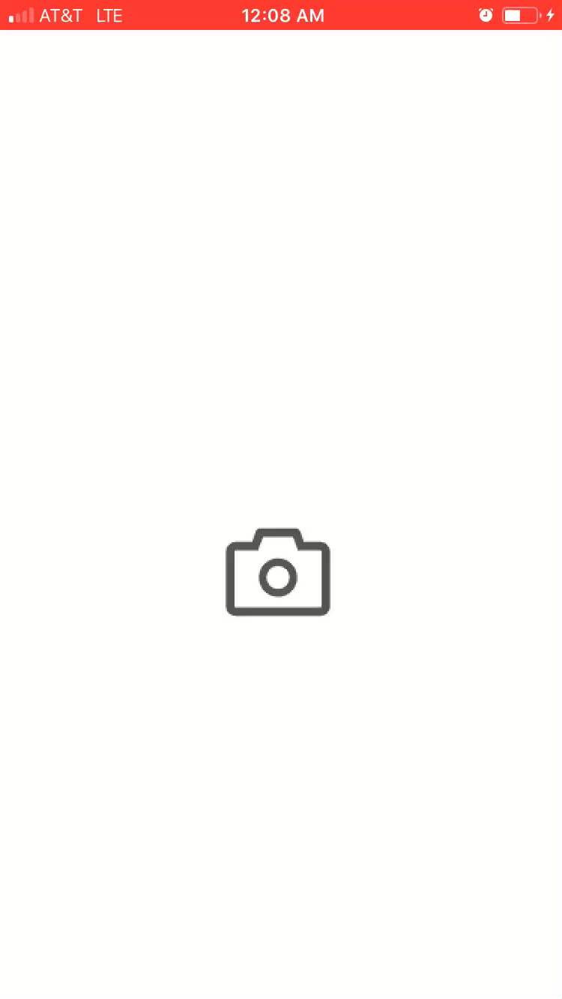
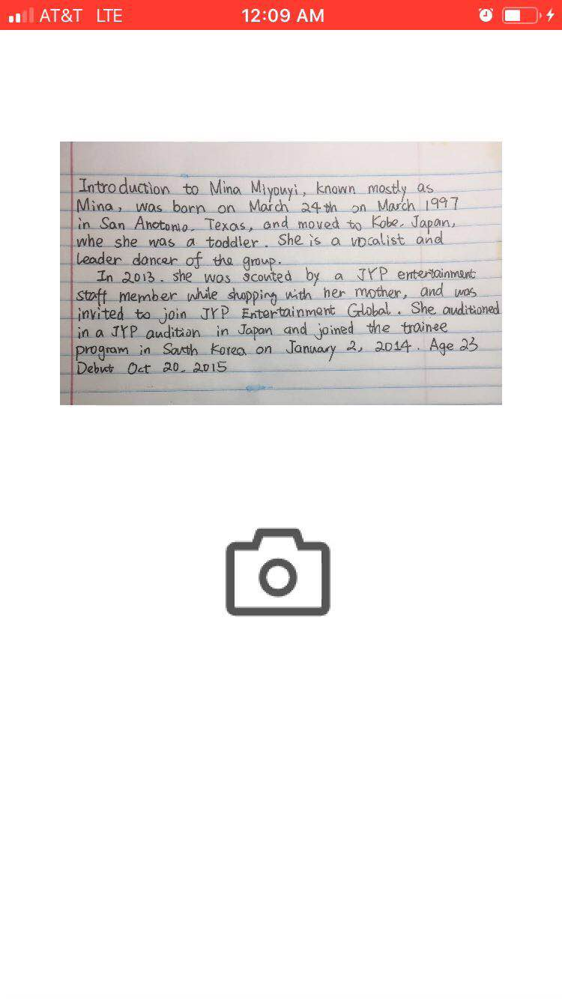
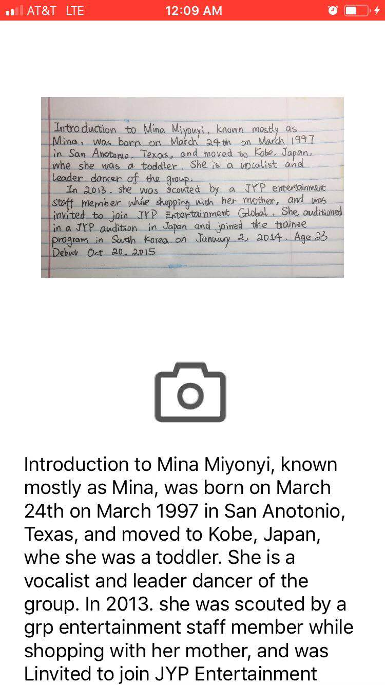

# ScanToSummary

> "When you are running out of time, you don't have to read 20+ pages of article before attending WRITING 101, all you need is just a summary of the material"

### sample demo







### frontend
```
pod install
open ListenText.xcworkspace 
```

### backend
```
cd server
source env/bin/activate
python3 index.py (localhost:5000)
```

### api endpoints
```
/: main page
/test: received post request from frontend

```

### file structure
```
ListenText
    ├── ViewController.swift 
    ├── Main.storyboard
server
    ├── index.py
    ├── resource
    │   └── test_img.png
    ├── article_summary.py
	├── ngrok
    └── vision_helper.py
```

### environment variables
```
TOKEN: generated by gcp service account
```


